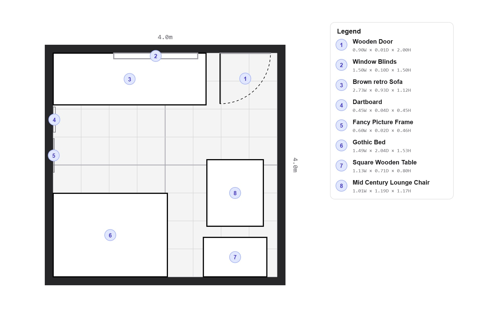
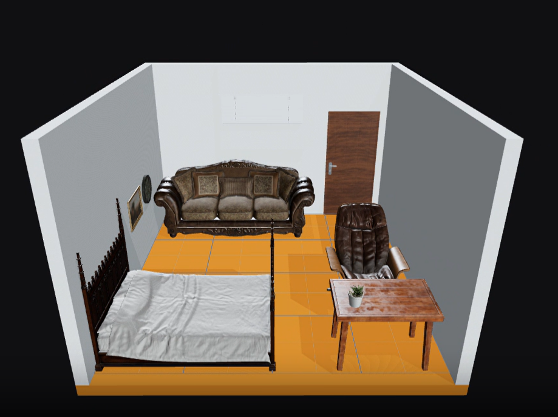
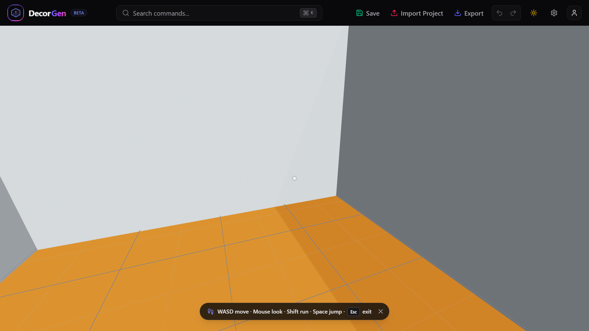
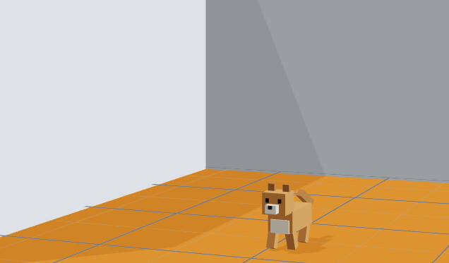

<div align="center">
  
  <h1>DecorGen: AI Interior Decorator</h1>
  <p>
    <b>An interactive, AI-assisted interior design platform.</b><br />
    <i>Engineered with Python, OpenCV, React 19, Three.js and React Three Fiber.</i>
  </p>
</div>

> DecorGen is a local-first interior design platform that turns 2D floor plans into interactive 3D layouts. Users can upload a 2D floor plan for automated layout parsing or place items dynamically using natural language prompts.

<div align="center">
  <table>
    <tr>
      <td align="center" width="50%">
        <b>📐 2D Floor Plan Editor</b><br />
        
      </td>
      <td align="center" width="50%">
        <b>📦 3D Real-Time Scene</b><br />
        
      </td>
    </tr>
    <tr>
      <td align="center" width="50%">
        <b>🚶 First-Person Walkthrough</b><br />
        
      </td>
      <td align="center" width="50%">
        <b>🐾 Smart Pet Simulation</b><br />
        
      </td>
    </tr>
  </table>
</div>

---

## 🌟 Key Features

### 📐 2D Floor Plan Image Analysis
* **Automated CV Pipeline:** Analyzes black-on-white 2D floor plans using OpenCV to detect rooms, furniture contours and rotated bounding boxes.
* **Smart OCR Labeling:** Recognizes room dimensions (`Ox`/`Oy` axes) and furniture text labels using PyTesseract OCR.
* **Auto-Calibration:** Calibrates coordinate scales relative to the room center, generating real-world aligned coordinate values.

### 🛋️ NLP & Semantic Search Pipeline
* **Prompt to GLB Extraction:** Parses natural language queries (English/Vietnamese) to extract target objects, RGB color overlays, scale adjustments and spatial placements.
* **Upgradable DistilBERT Classifier:** The pipeline can be optionally upgraded to a local DistilBERT model for ML-based entity recognition.
* **Hybrid Semantic Search:** Ranks and retrieves the best matching 3D `.glb` assets AND Room Templates using a hybrid of lexical token matching and semantic similarity. Upgradable to vector embeddings via `sentence-transformers`.
* **Direct Prompt-to-GLB API:** Dedicated endpoints that take a text prompt and instantly serve the optimal binary `.glb` model along with `X-Scene-Metadata` placement headers.
* **Built-in Swagger UI:** Provides interactive OpenAPI documentation at `/docs` hosted entirely on the custom Vanilla HTTP server.

### 🖥️ Interactive 2D & 3D Web Editors
* **2D Drawing Canvas:** Draw layouts, place templates and preview structural items on a precision canvas grid.
* **3D R3F Viewport:** Real-time 3D renderer built on React Three Fiber featuring OrbitControls camera manipulation and drag-and-drop coordinate adjusters.
* **First-Person Walkthrough Mode:** Explore designs at eye-level with WASD movement, mouse look and an automated ceiling render toggle.
* **Smart Pet Simulation:** Spawn a stylized 3D pet that walks around on the floor and utilizes real-time collision detection to avoid running through furniture.
* **Property Inspector:** Inspect and modify coordinates, rotation angles, scale multipliers and color overrides of selected objects in real time.
* **Scene Settings:** Customize environment HDRI presets, toggle realistic lighting, soft shadows, grid overlays and adjust camera FOV.
* **Project State Management:** 
  * Full **Undo/Redo** action history (powered by `zundo`).
  * **Import/Export Projects:** Save the entire room layout and 3D configuration locally and reload it anytime.
  * **Room Templates Search:** Browse, search and apply predefined room layouts seamlessly.

---

## 🛠️ Technology Stack


* **Backend & ML Pipeline:** 
  * Python (3.10+) | OpenCV | NumPy | PyTesseract (Tesseract OCR)
  * Vanilla HTTP (`ThreadingHTTPServer`) & FastAPI (ASGI)
  * *Optional upgrades:* `sentence-transformers` (Semantic Search), `transformers` & `torch` (DistilBERT Classifier)
* **Frontend Web App:** 
  * React 19 | Vite | TypeScript | Tailwind CSS (v4) | Radix UI | Lucide Icons
  * *3D Engine & Physics:* Three.js | React Three Fiber (R3F) | Drei | Rapier Physics (`@react-three/rapier`)
  * *State Management:* Zustand (Global Store) | Zundo (Undo/Redo History)

---

## 📂 Project Directory Structure

```text
DecorGen/
├── backend/            # Python API Backend
│   ├── src/
│   │   ├── 2d_extract/ # OpenCV & PyTesseract floor plan analysis
│   │   └── pipeline/   # HTTP Server, Semantic Search, NLP Extractor
│   ├── inputs/         # Static 3D models (.glb), assets metadata, & test images
│   ├── outputs/        # Generated scene metadata & 3D templates
│   └── requirements.txt
├── frontend/           # React 19 Frontend Web Application
│   ├── src/
│   │   ├── components/ # Viewports (2D Canvas/3D R3F) and Sidebar components
│   │   ├── store/      # Zustand state management
│   │   └── index.css   # Tailwind configuration
│   ├── package.json
│   └── vite.config.ts
└── README.md
```

---

## 🚀 Quick Start & Installation

Follow these steps to run both the backend server and the frontend web app on your local machine.

### 1️⃣ Set up the Backend

1. Navigate to the `backend` folder:
   ```bash
   cd backend
   ```
2. Install Python dependencies:
   ```bash
   pip install -r requirements.txt
   ```
3. *(Optional)* Install **Tesseract-OCR** for 2D floor plan OCR support:
   * **Windows:** Download the installer from UB Mannheim and add Tesseract to your PATH, or set it as an environment variable:
     ```powershell
     $env:TESSERACT_CMD = "C:\Program Files\Tesseract-OCR\tesseract.exe"
     ```
   * **macOS:** Install via Homebrew: `brew install tesseract`
   * **Linux:** Install via apt: `sudo apt-get install tesseract-ocr`
4. Start the backend server:
   ```bash
   python -m src.pipeline.server
   ```
   The backend will be running at `http://127.0.0.1:8000`. You can access the custom interactive Swagger API documentation at `http://127.0.0.1:8000/docs`.

### 2️⃣ Set up the Frontend

1. Navigate to the `frontend` folder:
   ```bash
   cd ../frontend
   ```
2. Install Node packages:
   ```bash
   npm install
   ```
3. Start the development server:
   ```bash
   npm run dev
   ```
   Open the browser at `http://localhost:5173`.

---

## 🔌 API Endpoints Summary

### 🛋️ 3D Asset & Template Endpoints

* **`GET /api/assets`**
  Scans and lists all available 3D `.glb` assets in the `inputs/` library.

* **`POST /api/assets/search`**
  Ranks assets against a prompt using hybrid semantic search.
  * **Request Body:** `{"prompt": "Một cái kệ sách bằng kim loại", "limit": 5}`

* **`GET /api/templates`**
  Scans and lists all available room template `.glb` files in `outputs/template/`.

* **`POST /api/templates/search`**
  Ranks templates against a prompt.
  * **Request Body:** `{"prompt": "Một phòng ngủ phong cách tối giản", "limit": 3}`

* **`POST /api/scene`**
  Parses a text prompt to build a JSON metadata scene object.
  * **Request Body:** `{"prompt": "Một chiếc sofa màu xanh đặt cạnh cửa sổ"}`

* **`POST /api/glb`**
  Parses a prompt, matches the best `.glb` asset and serves the binary file directly.
  * **Response:** Binary `.glb` payload with `X-Scene-Metadata` HTTP headers.

* **`GET /inputs/<file>.glb`** / **`GET /outputs/template/<file>.glb`**
  Direct download link to static asset or template files.

### 📐 Floor Plan Analysis

* **`POST /api/floor-plan/analyze`**
  Uploads a 2D floor plan image to extract rooms and detected objects.
  * **Request:** `multipart/form-data` containing a `file` field.
  * **Response:**
    ```json
    {
      "room": { "axes": { "Ox": 450, "Oy": 350 } },
      "items": [
        {
          "label": "table",
          "coordinates": { "x": 10.5, "y": -20.0 },
          "rotate": 0.0,
          "ocr_confidence": 85.5
        }
      ],
      "warnings": []
    }
    ```

---

## ⚙️ Advanced Environment Configuration

You can customize the NLP and search pipeline behavior using the following environment variables:

| Variable | Description | Default |
| :--- | :--- | :--- |
| `TESSERACT_CMD` | Explicit path to the local Tesseract-OCR executable. | *Auto-detected on Windows* |
| `SCENE_USE_EMBEDDINGS` | Set to `1` to enable Sentence-Transformers semantic model search. | `0` (Lexical fallback) |
| `SCENE_EMBEDDING_MODEL` | Hugging Face model identifier for vector generation. | `sentence-transformers/paraphrase-multilingual-MiniLM-L12-v2` |
| `SCENE_USE_DISTILBERT` | Set to `1` to enable local DistilBERT classifier for entity extraction. | `0` (Rule-based fallback) |
| `SCENE_DISTILBERT_DIR` | Path to the local directory containing pretrained DistilBERT weights. | `inputs/distilbert_scene_classifier` |
